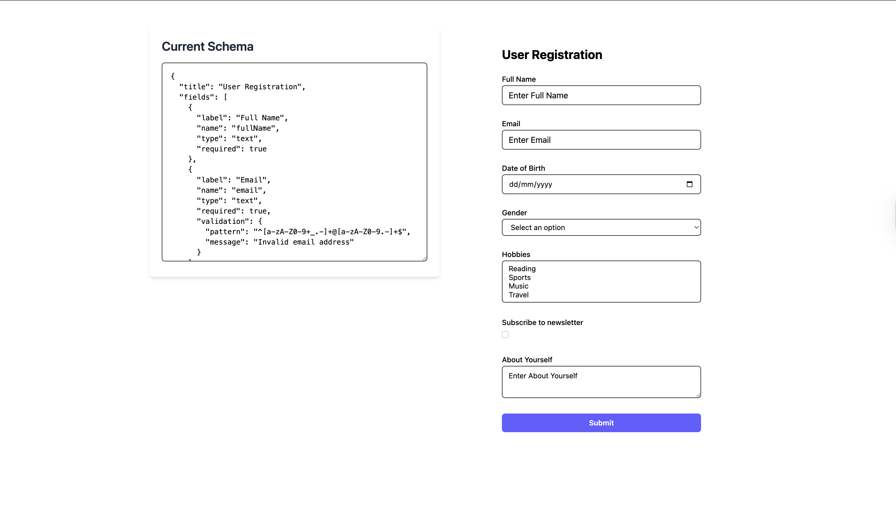
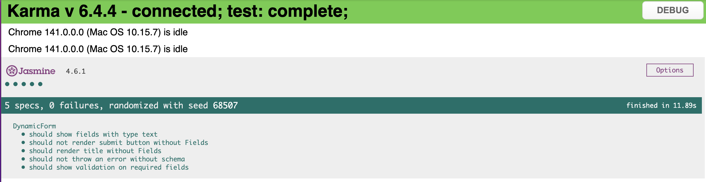

# Angular Dynamic Form Builder

## 🚀 Getting Started

### Installation

1. **Clone the repository**
   ```bash
   git clone https://github.com/TVAkshay/dynamic-form-renderer.git
   cd dynamic-form-renderer
   ```

2. **Install dependencies**
   ```bash
   npm install
   ```

3. **Start the development server**
   ```bash
   npm start
   # or
   ng serve
   ```

4. **Open your browser**
   Navigate to `http://localhost:4200/`

## 📖 Usage

### Basic Schema Example

```json
{
  "title": "User Registration",
  "fields": [
    {
      "label": "Full Name",
      "name": "fullName",
      "type": "text",
      "required": true
    },
    {
      "label": "Email",
      "name": "email",
      "type": "text",
      "required": true,
      "validation": {
        "pattern": "^[a-zA-Z0-9+_.-]+@[a-zA-Z0-9.-]+$",
        "message": "Invalid email address"
      }
    },
    {
      "label": "Age",
      "name": "age",
      "type": "number",
      "validation": {
        "min": 18,
        "max": 100
      }
    }
  ]
}
```

You will see this Screen with given schema.




### Advanced Schema with Validation

```json
{
  "title": "Contact Form",
  "fields": [
    {
      "label": "Username",
      "name": "username",
      "type": "text",
      "required": true,
      "validation": {
        "minLength": 3,
        "maxLength": 20,
        "message": "Username must be between 3 and 20 characters"
      }
    },
    {
      "label": "Country",
      "name": "country",
      "type": "dropdown",
      "options": ["USA", "UK", "Canada", "Australia"],
      "required": true
    },
    {
      "label": "Interests",
      "name": "interests",
      "type": "multiselect",
      "options": ["Sports", "Music", "Reading", "Travel"]
    },
    {
      "label": "Comments",
      "name": "comments",
      "type": "textarea",
      "placeholder": "Enter your comments here"
    }
  ]
}
```

## 🏗️ Project Structure

```
src/
├── app/
│   ├── components/
│   │   └── dynamic-form/
│   │       ├── dynamic-form.ts          # Form component logic
│   │       ├── dynamic-form.html        # Form template
│   │       ├── dynamic-form.css         # Form styles
│   │       └── dynamic-form.spec.ts     # Unit tests
│   ├── models/
│   │   └── form-schemas.ts              # TypeScript interfaces
│   ├── app.ts                           # Main app component
│   ├── app.html                         # Main app template
│   └── app.css                          # Main app styles
├── styles.css                           # Global styles
└── index.html                           # Entry HTML
```

## 🧪 Testing

Run unit tests with:

```bash
npm test
# or
ng test


```
You will see this Screen after running Tests 


## 🔧 Component Usage

### In Your Component

```typescript
import { DynamicForm } from './components/dynamic-form/dynamic-form';
import { FormSchema } from './models/form-schemas';

@Component({
  selector: 'app-example',
  imports: [DynamicForm],
  template: `
    <app-dynamic-form
      [schema]="formSchema"
      [initialValue]="initialData"
      (onSubmit)="handleSubmit($event)"
    ></app-dynamic-form>
  `
})
export class ExampleComponent {
  formSchema: FormSchema = {
    title: 'My Form',
    fields: [
      { label: 'Name', name: 'name', type: 'text', required: true }
    ]
  };

  initialData = { name: 'John Doe' };

  handleSubmit(formData: any) {
    console.log('Form submitted:', formData);
  }
}
```

## 🛠️ Technologies Used

- **Angular 20.3** - Frontend framework
- **TypeScript 5.9** - Programming language
- **Tailwind CSS 4.1** - Utility-first CSS framework
- **RxJS 7.8** - Reactive programming library
- **Karma & Jasmine** - Testing framework

